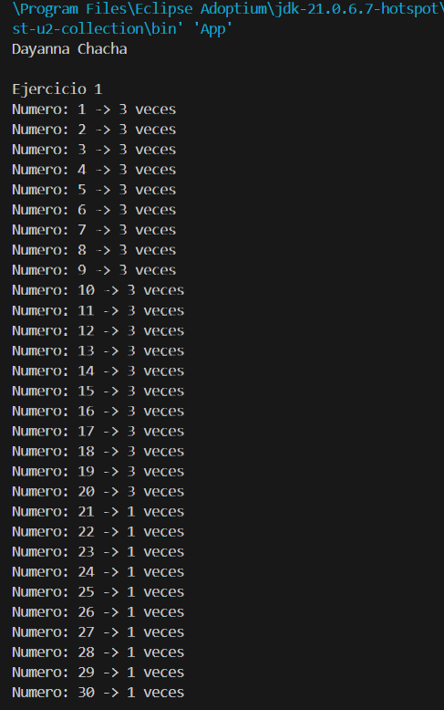
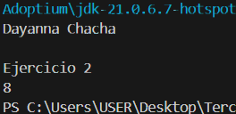
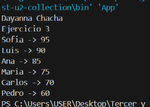

# Práctica: Estructuras No Lineales - 

## Autor
- Nombre: Janelly Dayanna Chacha Velez
- Carrera/Curso: Estructura de datos - Segundo Interciclo

##  Nombre de la práctica - Fecha
- Práctica: [Nombre exacto de la práctica]
- Fecha: 2026/12/01

## Descripción

## Evidencias
### Captura 1 - Ejercicio 1: Frecuencia de elementos
Dada una secuencia de N enteros, determine cuántas veces aparece cada número.

### Captura 2 - Ejercicio 2: Primer elemento no repetido
Dada una secuencia de enteros, determine el primer número que no se repite, respetando el orden de aparición.

### Captura 3 - Ejercicio 3: Ranking de puntajes
- Se recibe una lista de jugadores con su puntaje.
- Si un jugador aparece más de una vez, se conserva el mayor puntaje.
- Imprimir el ranking ordenado por puntaje descendente.

### Captura 4 - Ejercicio 4: Máximo por grupo
- Se ingresan estudiantes con su carrera y nota final.
- Mostrar la nota más alta por cada carrera

